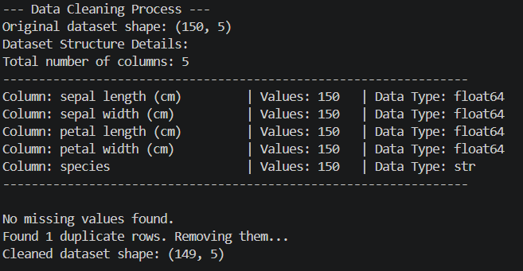
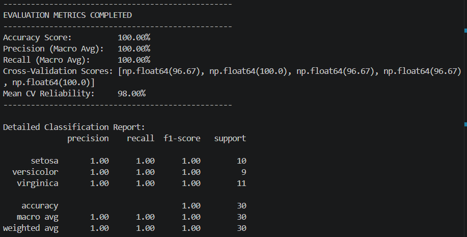
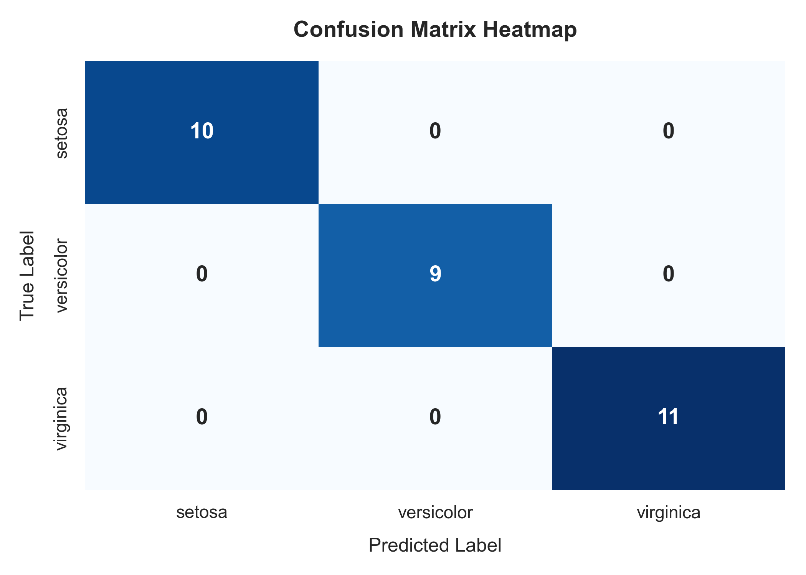
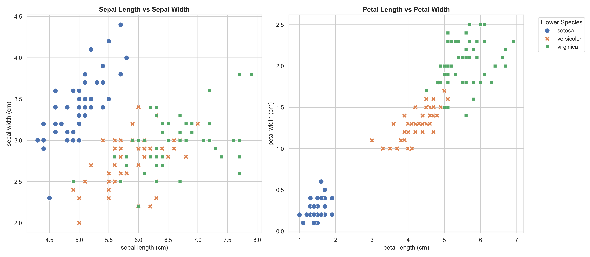

# Iris Flower Classification (SVM)

This project builds a Python Machine Learning pipeline to clean the classic Iris dataset, train a Support Vector Machine (SVM) model, and evaluate its performance using advanced metrics.

---

## Project 4 Steps

1. **Import:** Loads essential data science libraries (`pandas`, `scikit-learn`, `seaborn`, `matplotlib`).
2. **Load:** Automatically fetches the Iris dataset from `sklearn.datasets`.
-> iris_built_in = datasets.load_iris()

3. **Train:** Cleans the data and trains a Linear Support Vector Classifier (SVC).

4. **Predict & Evaluate:** Makes predictions on unseen data and calculates reliability metrics.

5. ** Results:**
Based on the console logs and visual distributions, the linear Support Vector Machine (SVM) classifier achieved flawless performance on the test set, yielding an Accuracy, Precision, and Recall of 100.00%. This peak performance is directly justified by the structural properties of the dataset exposed during feature analysis: while the sepal dimensions exhibit a crowded, overlapping boundary zone between Versicolor and Virginica, the petal features provide clean, distinct clusters with complete linear separability, allowing the SVM to easily construct optimal decision boundaries. This geometric advantage is mathematically confirmed by the Confusion Matrix, which reflects zero misclassifications across all test samples (10 Setosa, 9 Versicolor, and 11 Virginica). Furthermore, the 5-Fold Cross-Validation process confirms that this flawless test accuracy is highly stable and authentic rather than an artifact of a lucky data split, establishing a robust and highly reliable Mean CV Accuracy of 98.00% for real-world generalization.

